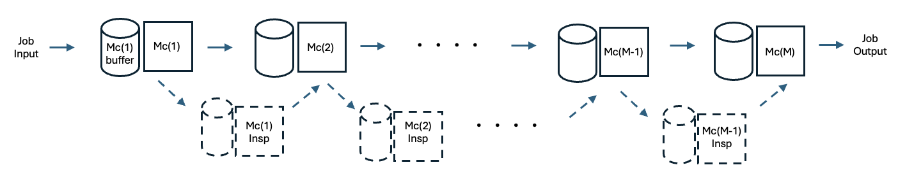
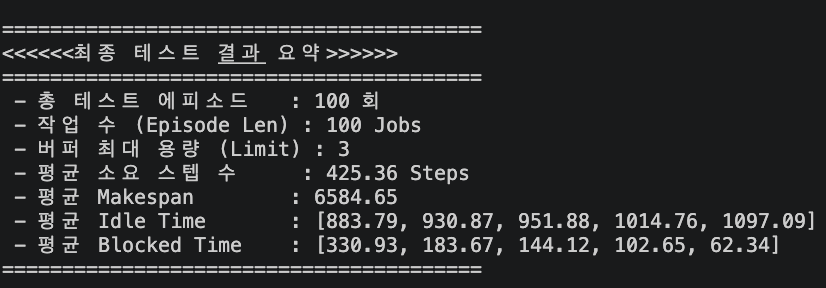
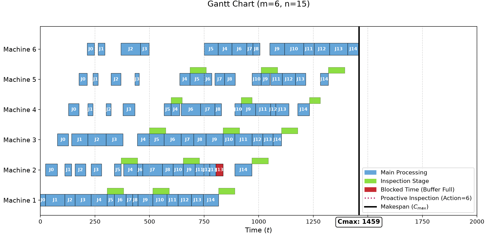

# DRL Environment code for the Non-Permutation Flowshop Scheduling Problem with Window Constrained Dynamic Operation Skipping and Limited Buffers (Demo)

DRL 에이전트 학습을 위한 **NPFSP(Non-Permutation Flowshop Scheduling Problem)**  시뮬레이터입니다. 본 환경은 검사 공정에서의 선택적 검사 공정 형태로 존재하는  **dynamic operation skipping** 와 **limited buffers** 라는 현실적인 제약 조건을 반영하여 설계되었습니다.

<br>

## Schematic

본 연구에서 제안하는 NPFSP 환경의 전반적인 작업 흐름과 버퍼 구조는 다음과 같다.



<br>

## 🚀 Getting Started

해당 레포지토리는 Mac OS 및 Windows 환경 모두에서 호환되도록 구성되었습니다. 코드를 실행하여 환경 시뮬레이터를 테스트하려면 아래의 과정을 따라 주세요.

### Prerequisites

본 시뮬레이터는 다음 환경에서 정상적으로 동작함을 보장합니다.

- **Python Version:** 3.11.9
- 필수 패키지는 아래와 같습니다.

```text
# requirements.txt
numpy==2.4.6
torch==2.12.0
```

<br>

### Installation
저장소를 클론한 뒤, 필수 의존성 패키지를 설치합니다
```text
# 1. 레포지토리 클론
git clone https://github.com/sanghunii/npfsp-missing-ops-env.git

# 2. 필수 패키지 설치
pip install -r requirements.txt
```

<br>

### Quick Start (Running Demo Test)
모든 설치가 완료되었다면, 아래의 테스트 코드를 통해 시뮬레이터를 실행시켜 볼 수 있습니다. <br>
- **공정 환경**: 두 데모 테스트 코드의 환경 셋팅은 6 Machines, 5 Inspection Machines로 동일하게 설정되어 있습니다.
- **동작 방식**: 두 데모 테스트 코드는 모든 머신에 대해 항상 FIFO(First-In, First-Out) 액션만 선택하도록 작성되었습니다.

<br> 

1. 대규모 인스턴스 테스트 및 결과 요약 (100 Jobs) <br>
100개의 Job으로 구성된 100개의 인스턴스를 연속으로 테스트하고 평균 성능을 확인하려면 아래 명령어를 실행하세요. 

```
python -m test_env
```

<br>

2. 단일 인스턴스 시뮬레이션 및 간트 차트 시각화 (15 Jobs) <br>
15개의 Job으로 구성된 단일 인스턴스(1개)의 스케줄링 과정을 시뮬레이션하고 간트 차트로 시각화하려면 아래 명령어를 실행하세요.

```
python -m test_env_gantt
```

<br>

## Results
명령어 실행 시 다음과 같은 결과를 확인할 수 있습니다.

#### 1. `python -m test_env`

터미널을 통해 100개의 인스턴스(Instance)에 대한 테스트 진행 상황이 출력됩니다.

테스트가 모두 종료되면 평균 Makespan, 누적 Idle Time, Blocked Time 등의 최종 스케줄링 통계 및 요약 결과를 터미널에서 확인할 수 있습니다. <br>



<br>


#### 2. `python -m test_env_gantt`

단일 인스턴스(15 Jobs)에 대한 테스트가 진행됩니다.

실행 직후, 전체 공정 흐름과 의사결정 결과를 직관적으로 파악할 수 있는 간트 차트(Gantt Chart) 이미지 창이 팝업으로 나타납니다. <br>




<br><br>


## Environment Code Overview

본 연구의 NPFSP 강화학습 시뮬레이터는 `Process` 클래스로 구현되어 있으며, 파이썬 기반으로 환경의 초기화, 상태/행동 공간(State/Action Space) 정의, 그리고 에피소드 진행을 관리한다.

<br>

### ⚙️ Initialization Arguments
환경(Environment) 객체 생성 시 다음과 같은 주요 파라미터를 입력받아 동적으로 스케줄링 환경을 구성한다.

* **`num_machines` (int):** 공정 내 기계(Machine)의 총 개수 ($m$).
* **`process_range` (List[Tuple[int, int]]):** 각 기계별 가공 시간(Processing time)의 범위를 지정하는 리스트. 각 기계마다 `(최소 시간, 최대 시간)` 형태의 튜플로 주어진다.
* **`episode_len_list` (List[int]):** 한 에피소드(Batch)에서 처리할 전체 작업(Job) 수의 후보군. (예: `[15, 30, 50, 75, 100]`)
* **`buffer_limit` (int):** 두 번째 기계부터 마지막 기계 사이, 그리고 검사대(Inspection machine) 앞의 대기 버퍼 최대 용량 ($C$). (첫 번째 기계의 버퍼는 무한대로 동작한다.)

<br>

### ⚙️ Core Environment Logic: `step()`

환경의 상태 전이(State Transition)를 담당하는 `step()` 함수는 Event-Driven 방식으로 설계되었으며, 크게 **4가지 Phase**로 나뉘어 실행된다.

#### Phase 1. Action Processing & Buffer Sorting
Agent로부터 전달받은 Action을 해석하여 각 Machine의 Buffer를 정렬한다.
- **Buffer Sorting:** 전달받은 action 값을 기반으로 각 Machine 앞의 Buffer 대기열을 재정렬한다.
- **Action Masking (`-1`):** 현재 단계에서 작업 할당이 필요 없는(작업 중이거나 Blocked 상태인) Machine은 `-1`을 action으로 받는다. 즉, 직전 단계에서 `available_machines[m] == True`였던 Machine들만 유효한 action을 수행한다.
  > *이때 `available_machines[m] == False`인 machine이 `-1` action을 받지 않아도 상관없으며, 이후 이어질 로직에서 해당 machine에 대한 실질적인 job 투입은 일어나지 않는다.*

<br>

#### Phase 2. Job Allocation (Reverse Order)
정렬된 Buffer를 바탕으로 Machine에 Job을 투입한다. 병목 현상(Blocking)을 정확히 모사하기 위해 **마지막 Machine부터 역순(Backward)**으로 할당을 진행한다.

1. **Buffer 공간 확보:** $m$번째 Machine에 Job이 할당되면 해당 Machine의 Buffer에 빈자리가 1개 발생한다.
2. **우선순위 기반 Job 이동:** 빈자리가 생겼을 때, 직전 단계에서 잔여 작업 시간(`remain_time`)이 `0`임에도 Blocked 상태였던 Job들을 끌어온다.
   - **Priority 1:** 직전 Inspection Machine에 대기 중인 Job (`remain_time == 0`)
   - **Priority 2:** $m-1$번째 Main Machine에 대기 중인 Job (`remain_time == 0`)
   - 위 조건에 해당하면 Job을 $m$번째 Buffer로 이동시킨 후, $m-1$번째 Machine에 새로운 Job 투입을 진행한다.

<br>

#### Phase 3. Time Progression & Event Evaluation
다음 의사결정 시점(`transition_point == True`)이 도달할 때까지 가상 시간을 흐르게 하며 Job을 물리적으로 이동시킨다. 
*(조건: `available_machines` 중 하나라도 `True`가 될 때까지 반복)*

##### 3-1. Time Update
- **Processing Time 계산:** 현재 작업 중인 Job들의 잔여 시간 중 **최솟값(Min)**만큼 시간을 진행시킨다.
- **Metrics 누적:** 진행된 시간만큼 각 Machine의 Idle time과 Blocked time을 누적한다. (Agent의 보상/상태 정보로 활용)
- **Remain Time 갱신:** 각 Machine의 잔여 작업 시간을 차감한다.

##### 3-2. Physical Job Movement (Reverse Order)
시간 갱신 후 `remain_time == 0`이 된 Job들을 다음 단계로 이동시킨다. 이 역시 마지막 Machine부터 역순으로 검사한다.

**A. Last Machine**
- Agent의 의사결정이 개입하지 않는다.
- 작업이 끝난 Job이 전체의 마지막 Job이 아니면, Buffer 상태에 따라 대기 중인 Job을 즉시 투입하거나 대기(Idle) 상태로 전환한다.

**B. Inspection Machine ($m$)**
- **$m+1$ Machine Buffer Empty:** Job을 $m+1$로 투입한다. (이때 $m+1$이 Last Machine이고 비어있다면 즉시 작업 시작)
- **$m+1$ Machine Buffer Full:** Job은 이동하지 못하고 **Blocked** 처리된다.
- 투입 성공 시, 빈자리에 Inspection 대기 중인 Job을 바로 할당하며, $m+1$ Buffer가 비어있었다면 연쇄 작용을 위해 `trigger_wakeup = True`를 발생시킨다.

> 💡 **[Rule] Inspection Priority:** > Inspection Machine은 Main Machine보다 Job을 다음 단계로 넘기는 데 **우선권**을 갖는다. $m+1$ Buffer에 1자리만 남았고 $m$과 Inspection Machine 모두 `remain_time == 0`이 되었다면, Inspection Machine의 Job이 먼저 이동하고 $m$ Machine은 Blocked 된다.

**C. Main Machine ($m$)**
- **Inspection 대상 Job (Forced/Bypass):** Inspection Buffer에 자리가 있으면 투입, 비어있다면 즉시 할당한다.
- **Inspection 비대상 Job:** $m+1$ Machine Buffer 상태에 따라 투입하거나 Blocked 처리된다. ($m+1$ Buffer가 비어있었다면 `trigger_wakeup = True`)

##### 3-3. Transition Flag Update (`available_machines`)
- **Wake-up Check (`trigger_wakeup`):** $m+1$ Machine에 Job이 투입되어 상태가 변했을 때, 이전 Machine들의 Blocking 상태가 해제될 수 있는지 미래 상태(`b_m2_will_open` 등)를 확인하여 `available_machines` 플래그를 `True`로 갱신한다.
- **Current Machine Check:** $m$ Machine이 비어있고 Buffer에 대기 Job이 있거나, Blocked 상태지만 다음 루프에서 자리가 날 예정(연쇄 해제)이라면 `available_machines[m] = True`로 설정한다.

<br>

#### Phase 4. State Generation
`transition_point`가 활성화되어 루프를 빠져나오면, 업데이트된 환경을 바탕으로 State Value들을 계산한다.
- 각 Machine의 Buffer 상태, 누적 Idle/Blocked 시간, Job의 잔여 시간 등을 종합하여 **State Vector**를 생성하고 Agent에게 반환(`return`)한다.
